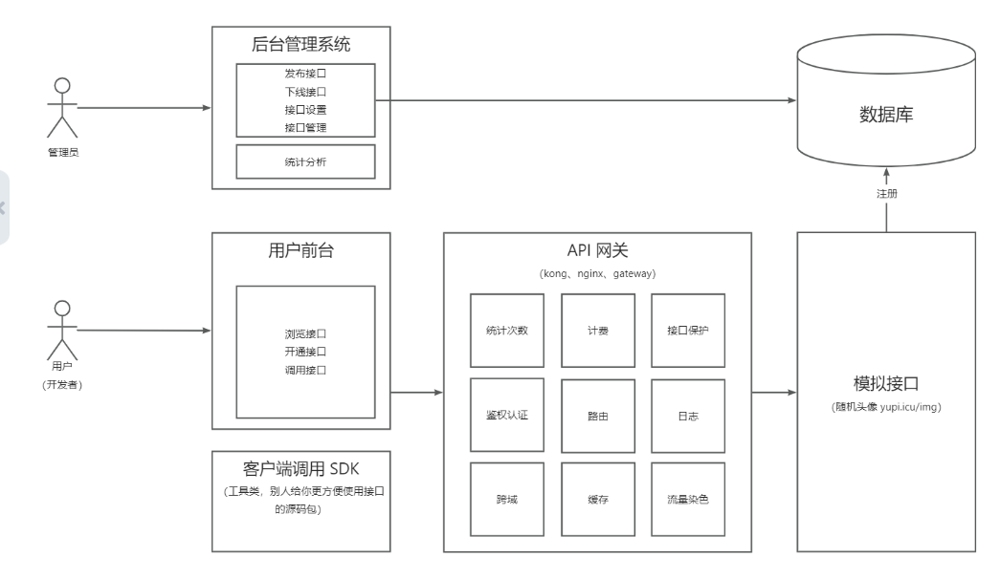
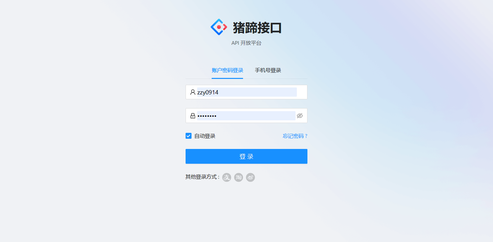
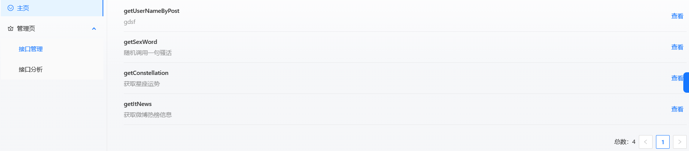
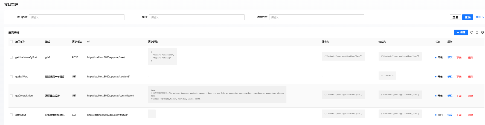
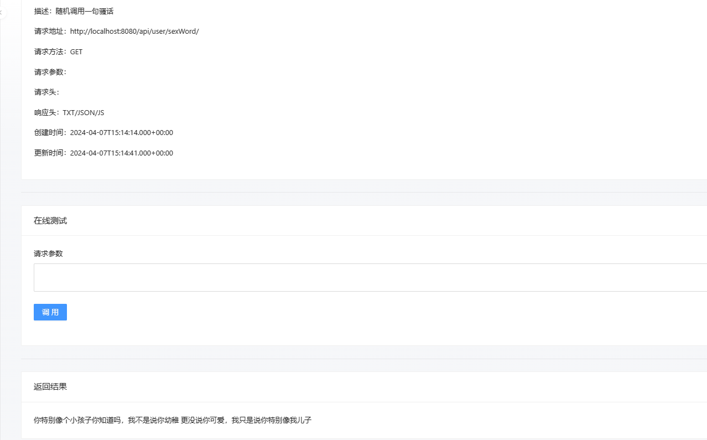

## 猪蹄接口平台

### 1. 项目概述

猪蹄接口平台是一个全栈微服务项目，提供 API 接口供开发者调用。该项目基于 Spring Boot 后端和 React 前端构建。管理员可以接入并发布接口，统计分析各接口调用情况。用户可以注册登录并开通接口调用权限、浏览接口、在线调试，还能使用客户端 SDK 轻松在代码中调用接口。

### 2. 项目架构

#### 2.1 项目结构

项目包含以下模块：

- **zzy-api-backend：** 提供用户、接口等基本操作的后端服务。
- **zzy-api-common：** 包含公共实体类和接口的项目公共模块。
- **zzy-api-gateway：** 作为后端的入口，负责服务转发、用户鉴权、统一日志、服务接口调用计数和统一业务处理的 API 网关。
- **zzy-api-interface：** 平台提供的接口服务，可更新扩展。
- **zzy-api-client-sdk：** 提供给开发者的 SDK，用于简化后端调用，并使项目结构更加简洁。

#### 2.2 项目流程

用户登录后通过浏览器浏览接口并调用接口发出请求，请求发到后端服务器，经过sdk客户端对请求进行签名认证并把请求发送给API网关。网关对请求进行鉴权、统一日志和对接口检查，若通过则将请求发送到接口服务后端，接口服务返回调用结果，网关会对结果进行日志处理和处理调用成功后的一系列业务。

#### 2.3 项目技术栈


- Java Spring Boot
- MySQL 数据库
- MyBatis-Plus 及 MyBatis X 自动生成
- API 签名认证（Http 调用）
- Spring Boot Starter（SDK 开发）
- Dubbo 分布式（RPC、Nacos）
- Swagger + Knife4j 接口文档生成
- Spring Cloud Gateway 微服务网关
- Hutool、Apache Common Utils、Gson 等工具库 

### 3. 数据库表设计

```markdown
## 用户表 (`user`)

| 列名          | 数据类型     | 允许为空 | 默认值                   | 注释                     |
|--------------|--------------|----------|--------------------------|--------------------------|
| id           | bigint       | 否       | 自增长                    | 用户唯一标识              |
| userName     | varchar(256) | 是       |                          | 用户昵称                  |
| userAccount  | varchar(256) | 否       |                          | 用户账号                  |
| userAvatar   | varchar(1024)| 是       |                          | 用户头像                  |
| gender       | tinyint      | 是       |                          | 性别                      |
| userRole     | varchar(256) | 否       | 'user'                   | 用户角色                  |
| userPassword | varchar(512) | 否       |                          | 密码                      |
| accessKey    | varchar(512) | 否       |                          | 访问密钥                  |
| secretKey    | varchar(512) | 否       |                          | 秘密密钥                  |
| createTime   | datetime     | 否       | CURRENT_TIMESTAMP        | 创建时间                  |
| updateTime   | datetime     | 否       | CURRENT_TIMESTAMP        | 更新时间                  |
| isDelete     | tinyint      | 否       | 0                        | 是否删除                  |

## 接口信息表 (`interface_info`)

| 列名           | 数据类型     | 允许为空 | 默认值                   | 注释                     |
|---------------|--------------|----------|--------------------------|--------------------------|
| id            | bigint       | 否       | 自增长                    | 接口唯一标识              |
| name          | varchar(256) | 否       |                          | 接口名称                  |
| description   | varchar(256) | 是       |                          | 描述                      |
| url           | varchar(512) | 否       |                          | 接口地址                  |
| requestParams | text         | 是       |                          | 请求参数                  |
| requestHeader | text         | 是       |                          | 请求头                    |
| responseHeader| text         | 是       |                          | 响应头                    |
| status        | int          | 否       | 0                        | 接口状态                  |
| method        | varchar(256) | 否       |                          | 请求类型                  |
| userId        | bigint       | 否       |                          | 创建人                    |
| createTime    | datetime     | 否       | CURRENT_TIMESTAMP        | 创建时间                  |
| updateTime    | datetime     | 否       | CURRENT_TIMESTAMP        | 更新时间                  |
| isDelete      | tinyint      | 否       | 0                        | 是否删除                  |

## 用户调用接口关系表 (`user_interface_info`)

| 列名           | 数据类型     | 允许为空 | 默认值                   | 注释                     |
|---------------|--------------|----------|--------------------------|--------------------------|
| id            | bigint       | 否       | 自增长                    | 关系唯一标识              |
| userId        | bigint       | 否       |                          | 调用用户 id              |
| interfaceInfoId| bigint      | 否       |                          | 接口 id                  |
| totalNum      | int          | 否       | 0                        | 总调用次数                |
| leftNum       | int          | 否       | 0                        | 剩余调用次数              |
| status        | int          | 否       | 0                        | 状态                      |
| createTime    | datetime     | 否       | CURRENT_TIMESTAMP        | 创建时间                  |
| updateTime    | datetime     | 否       | CURRENT_TIMESTAMP        | 更新时间                  |
| isDelete      | tinyint      | 否       | 0                        | 是否删除                  |
```


### 4.项目演示
#### 4.1 登录


#### 4.2 管理员登陆后


#### 4.3 管理员可对接口进行修改


#### 4.4 接口使用情况分析


#### 4.5 调用接口

